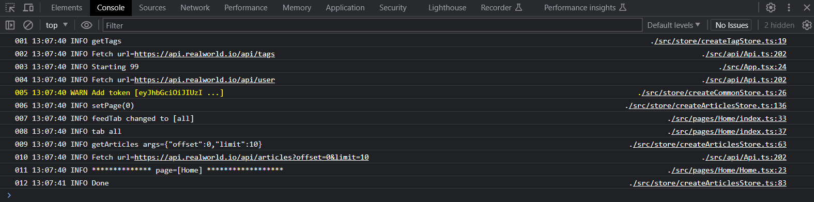

## bowser-logger



This logger can be used as a replacement for *console.log(...)* messages
that are a ubiquitous requirement when developing browser applications.

The logger has the following useful features:

* Advanced [sprintf-js] message formatting
* Use of source maps for module & line number lookup
* Integration with VSCODE, (click on a log message to open file in the editor)
* Configurable color coded messages based on INFO, WARN, ERROR, etc
* Optional message index
* Optional message timestamp

*Example output*
```
001 09:45:05 INFO setCounter(0)                   ./src/counter.ts:5
002 09:45:10 INFO setCounter(1)                   ./src/counter.ts:5
003 09:45:10 WARN Resource low                    ./src/res_mon.ts:225
```
### Usage

    npm install browser-logger

*./utils/logger.ts*
```
import { BrowserLog, LogLevel } from 'browser-logger'

export const logger = new BrowserLog({
  format: '{{index}} {{timestamp}} {{title}} {{message}}{{rhs}}{{file}}:{{line}}',
  dateformat: 'HH:MM:ss',
  level: LogLevel.INFO
})

export { logger, LogLevel }
```

```
import { logger, LogLevel } from './utils/logger'

// Log something

logger.info('The index is %04d', index)
logger.warn('Add token [%s ...]', 'mytoken')

// Change logging level

logger.setLevel(LogLevel.WARN)
```

#### Fields

The configuration *format* field is a string containing any combination, in any order, of the
following fields:

**{{timestamp}}**: time of log message, format can be changed by changing the configuration [dateformat] field.

**{{index}}**: log message count, format can be changed by changing the configuration *indexFormat* field.

**{{title}}**: log message level:   LOG, TRACE, DEBUG, INFO, WARN, ERROR, FATAL

**{{message}}**: the user supplied log message

**{{rhs}}**: pushes any following fields to the right hand side

**{{file}}**: the log message module name, resolved from source-map

**{{line}}**: the log message module line number, resolved from source-map

For example:

    format: '{{timestamp}} {{message}}{{rhs}}{{file}}:{{line}}'

#### Transport

The log message, fully composed, is passed to a transport function for display. The default
transport is shown below:

```
  transport: function (data: ITransport) {
    if (data.title === LogLevel.WARN) {
      queueMicrotask(console.log.bind(console, `%c${data.output}`, "color:yellow"))
    } else if (data.level > LogLevel.WARN) {
      queueMicrotask(console.log.bind(console, `%c${data.output}`, "color:red"))
    } else {
      queueMicrotask(console.log.bind(console, data.output))
    }
  }
```

A custom transport function can be defined in the configuration object.

### Browser Compatibility

The logger has be tested on Chrome, Firefox and MS Edge

#### Source maps

To resolve module and line numbers correctly *source-maps* must be
enabled in the development build.

### Prior work

This code is a reworking in Typescript of the node based [tracer] logging package.

### Links

* [sprintf-js]
* [dateformat]
* [tracer]

[tracer]: https://www.npmjs.com/package/tracer
[sprintf-js]: https://www.npmjs.com/package/sprintf-js
[dateformat]: https://github.com/felixge/node-dateformat#mask-options
